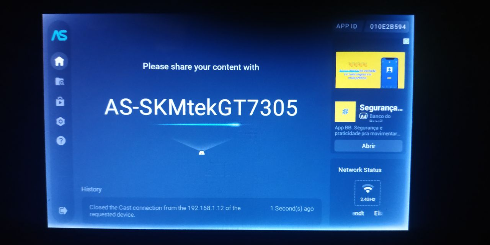
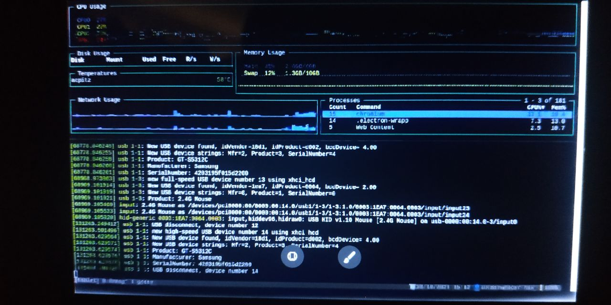

Remote display receiver, useful to use the cast functionality to pass content to an Android device like a tablet.

# Features

- Miracast receiver
- DLNA DMR
- Can receive content from Google Chrome
- Can receive content from your phone android display

# Screenshots

