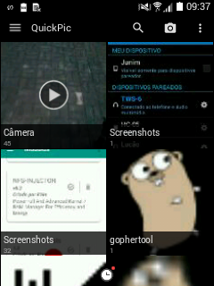

**BEWARE**: the newer versions are owned by Cheetah Mobile, that is known to provide crap apps, the older versions work just fine and you can download them using the variant system provided by APKMirror

The linked XDA thread is a resign of the last independent version of QuickPic before CM aquisition to avoid being auto updated by Google Play Store.

It's the best gallery out there, fast, snappy and works on really old phones. There are versions still working that are compatible with Android 2.3

# Features

- Recent photos
- Show photos by folder using the album abstraction
- You can setup which folders it should index for photos
- Simple image editor
- Local network file transfer

# Screenshots

